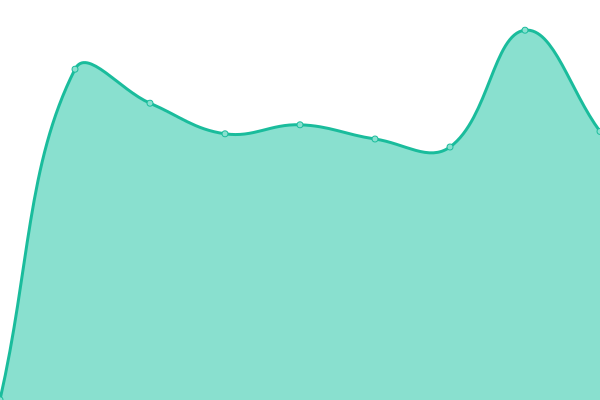

# [📈 Live Status](https://upptime.github.io/upptime): <!--live status--> **🟩 All systems operational**

This repository contains the open-source uptime monitor and status page for [Upptime](https://upptime.js.org), powered by [Upptime](https://github.com/upptime/upptime).

With [Upptime](https://upptime.js.org), you can get your own unlimited and free uptime monitor and status page, powered entirely by a GitHub repository. We use [Issues](https://github.com/upptime/upptime/issues) as incident reports, [Actions](https://github.com/hari64//inflancer-uptime/actions) as uptime monitors, and [Pages](https://upptime.github.io/upptime) for the status page.

<!--start: status pages-->
<!-- This summary is generated by Upptime (https://github.com/upptime/upptime) -->
<!-- Do not edit this manually, your changes will be overwritten -->
<!-- prettier-ignore -->
| URL | Status | History | Response Time | Uptime |
| --- | ------ | ------- | ------------- | ------ |
|  [Meroaspatal](https://meroaspatal.com/) | 🟩 Up | [meroaspatal.yml](https://github.com/hari64/inflancer-uptime/commits/HEAD/history/meroaspatal.yml) | 

 424ms
     
 | 

<a href="https://hari64.github.io/inflancer-uptime/history/meroaspatal">89.64%</a>
    

|  [Meroaspatal API](https://meroaspatal.com/api/health/) | 🟩 Up | [meroaspatal-api.yml](https://github.com/hari64/inflancer-uptime/commits/HEAD/history/meroaspatal-api.yml) | 

 125ms
     
 | 

<a href="https://hari64.github.io/inflancer-uptime/history/meroaspatal-api">89.65%</a>
    

|  [Surugara](https://beta.surugara.com/) | 🟩 Up | [surugara.yml](https://github.com/hari64/inflancer-uptime/commits/HEAD/history/surugara.yml) | 

 526ms
     
 | 

<a href="https://hari64.github.io/inflancer-uptime/history/surugara">100.00%</a>
    

|  [Nayahardware](https://nayahardware.com/) | 🟩 Up | [nayahardware.yml](https://github.com/hari64/inflancer-uptime/commits/HEAD/history/nayahardware.yml) | 

 1538ms
     
 | 

<a href="https://hari64.github.io/inflancer-uptime/history/nayahardware">100.00%</a>
    

|  [TournaOP](https://tournaop.com/) | 🟩 Up | [tourna-op.yml](https://github.com/hari64/inflancer-uptime/commits/HEAD/history/tourna-op.yml) | 

 683ms
     
 | 

<a href="https://hari64.github.io/inflancer-uptime/history/tourna-op">100.00%</a>
    

|  [Juttastudio](https://juttastudio.com/) | 🟩 Up | [juttastudio.yml](https://github.com/hari64/inflancer-uptime/commits/HEAD/history/juttastudio.yml) | 

 1479ms
     
 | 

<a href="https://hari64.github.io/inflancer-uptime/history/juttastudio">100.00%</a>
    

|  [Ekjhola](https://ekjhola.com/) | 🟩 Up | [ekjhola.yml](https://github.com/hari64/inflancer-uptime/commits/HEAD/history/ekjhola.yml) | 

 1537ms
     
 | 

<a href="https://hari64.github.io/inflancer-uptime/history/ekjhola">100.00%</a>
    

|  [Khudra Store](https://khudrastore.com/) | 🟩 Up | [khudra-store.yml](https://github.com/hari64/inflancer-uptime/commits/HEAD/history/khudra-store.yml) | 

 1563ms
     
 | 

<a href="https://hari64.github.io/inflancer-uptime/history/khudra-store">99.79%</a>
    

|  [The Job Room](https://thejobroom.com/) | 🟩 Up | [the-job-room.yml](https://github.com/hari64/inflancer-uptime/commits/HEAD/history/the-job-room.yml) | 

 1405ms
     
 | 

<a href="https://hari64.github.io/inflancer-uptime/history/the-job-room">100.00%</a>
    

|  [Khana247](https://admin.khana247.com/admin/auth/login) | 🟩 Up | [khana247.yml](https://github.com/hari64/inflancer-uptime/commits/HEAD/history/khana247.yml) | 

 885ms
     
 | 

<a href="https://hari64.github.io/inflancer-uptime/history/khana247">100.00%</a>
    

|  [Thyakkai](https://thyakkai.com/) | 🟩 Up | [thyakkai.yml](https://github.com/hari64/inflancer-uptime/commits/HEAD/history/thyakkai.yml) | 

 1172ms
     
 | 

<a href="https://hari64.github.io/inflancer-uptime/history/thyakkai">100.00%</a>
    

|  [Bechideu](https://bechideu.com/) | 🟩 Up | [bechideu.yml](https://github.com/hari64/inflancer-uptime/commits/HEAD/history/bechideu.yml) | 

 1422ms
     
 | 

<a href="https://hari64.github.io/inflancer-uptime/history/bechideu">100.00%</a>
    

|  [Ohmnom](https://admin.ohmnom.com/) | 🟩 Up | [ohmnom.yml](https://github.com/hari64/inflancer-uptime/commits/HEAD/history/ohmnom.yml) | 

 760ms
     
 | 

<a href="https://hari64.github.io/inflancer-uptime/history/ohmnom">100.00%</a>
    

|  [Machamasu](https://machamasu.dhanapati.com/admin) | 🟩 Up | [machamasu.yml](https://github.com/hari64/inflancer-uptime/commits/HEAD/history/machamasu.yml) | 

 1366ms
     
 | 

<a href="https://hari64.github.io/inflancer-uptime/history/machamasu">100.00%</a>
    

|  [Lagaani Store](https://beta.lagaanistore.com/) | 🟩 Up | [lagaani-store.yml](https://github.com/hari64/inflancer-uptime/commits/HEAD/history/lagaani-store.yml) | 

 539ms
     
 | 

<a href="https://hari64.github.io/inflancer-uptime/history/lagaani-store">100.00%</a>
    

|  [Surugara](https://beta.surugara.com/) | 🟩 Up | [surugara.yml](https://github.com/hari64/inflancer-uptime/commits/HEAD/history/surugara.yml) | 

 526ms
     
 | 

<a href="https://hari64.github.io/inflancer-uptime/history/surugara">100.00%</a>
    

|  [Dhanapati](https://dhanapati.com/) | 🟩 Up | [dhanapati.yml](https://github.com/hari64/inflancer-uptime/commits/HEAD/history/dhanapati.yml) | 

 527ms
     
 | 

<a href="https://hari64.github.io/inflancer-uptime/history/dhanapati">100.00%</a>
    

|  [Upit Studio](https://upit.dhanapati.com/) | 🟩 Up | [upit-studio.yml](https://github.com/hari64/inflancer-uptime/commits/HEAD/history/upit-studio.yml) | 

 564ms
     
 | 

<a href="https://hari64.github.io/inflancer-uptime/history/upit-studio">100.00%</a>
    

|  [Sodhpuch](https://beta.sodhpuch.com/) | 🟩 Up | [sodhpuch.yml](https://github.com/hari64/inflancer-uptime/commits/HEAD/history/sodhpuch.yml) | 

 608ms
     
 | 

<a href="https://hari64.github.io/inflancer-uptime/history/sodhpuch">100.00%</a>
    

|  [Mero Degree](https://merodegree.dhanapati.com/) | 🟩 Up | [mero-degree.yml](https://github.com/hari64/inflancer-uptime/commits/HEAD/history/mero-degree.yml) | 

 585ms
     
 | 

<a href="https://hari64.github.io/inflancer-uptime/history/mero-degree">99.48%</a>
    

|  [Share a Book Nepal](https://shareabooknepal.com/) | 🟩 Up | [share-a-book-nepal.yml](https://github.com/hari64/inflancer-uptime/commits/HEAD/history/share-a-book-nepal.yml) | 

 547ms
     
 | 

<a href="https://hari64.github.io/inflancer-uptime/history/share-a-book-nepal">57.32%</a>
    

|  [Mart](https://mart.inflancer.tech/) | 🟩 Up | [mart.yml](https://github.com/hari64/inflancer-uptime/commits/HEAD/history/mart.yml) | 

 949ms
     
 | 

<a href="https://hari64.github.io/inflancer-uptime/history/mart">100.00%</a>
    

|  [Phisss](https://admin.phisss.com/) | 🟩 Up | [phisss.yml](https://github.com/hari64/inflancer-uptime/commits/HEAD/history/phisss.yml) | 

 1091ms
     
 | 

<a href="https://hari64.github.io/inflancer-uptime/history/phisss">100.00%</a>
    

|  [Rentgara](https://rentgara.dhanapati.com/) | 🟩 Up | [rentgara.yml](https://github.com/hari64/inflancer-uptime/commits/HEAD/history/rentgara.yml) | 

 529ms
     
 | 

<a href="https://hari64.github.io/inflancer-uptime/history/rentgara">100.00%</a>
    

<!--end: status pages-->

[**Visit our status website →**](https://upptime.github.io/upptime)

## 📄 License

- Powered by: [Upptime](https://github.com/upptime/upptime)
- Code: [MIT](./LICENSE) © [Anand Chowdhary](https://anandchowdhary.com), supported by [Pabio](https://pabio.com)
- Data in the `./history` directory: [Open Database License](https://opendatacommons.org/licenses/odbl/1-0/)
