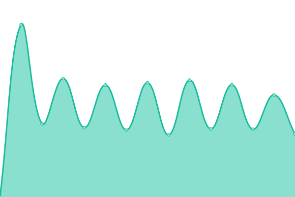

# [📈 Live Status](https://upptime.github.io/upptime): <!--live status--> **🟧 Partial outage**

This repository contains the open-source uptime monitor and status page for [Upptime](https://upptime.js.org), powered by [Upptime](https://github.com/upptime/upptime).

With [Upptime](https://upptime.js.org), you can get your own unlimited and free uptime monitor and status page, powered entirely by a GitHub repository. We use [Issues](https://github.com/upptime/upptime/issues) as incident reports, [Actions](https://github.com/hari64//inflancer-uptime/actions) as uptime monitors, and [Pages](https://upptime.github.io/upptime) for the status page.

<!--start: status pages-->
<!-- This summary is generated by Upptime (https://github.com/upptime/upptime) -->
<!-- Do not edit this manually, your changes will be overwritten -->
<!-- prettier-ignore -->
| URL | Status | History | Response Time | Uptime |
| --- | ------ | ------- | ------------- | ------ |
|  [Surugara](https://admin.surugara.com/) | 🟩 Up | [surugara.yml](https://github.com/hari64/inflancer-uptime/commits/HEAD/history/surugara.yml) | 

 1618ms
     
 | 

<a href="https://hari64.github.io/inflancer-uptime/history/surugara">99.50%</a>
    

|  [TournaOP](https://tournaop.com/) | 🟩 Up | [tourna-op.yml](https://github.com/hari64/inflancer-uptime/commits/HEAD/history/tourna-op.yml) | 

 743ms
     
 | 

<a href="https://hari64.github.io/inflancer-uptime/history/tourna-op">100.00%</a>
    

|  [Juttastudio-Admin](https://admin.juttastudio.com/) | 🟩 Up | [juttastudio-admin.yml](https://github.com/hari64/inflancer-uptime/commits/HEAD/history/juttastudio-admin.yml) | 

 2733ms
     
 | 

<a href="https://hari64.github.io/inflancer-uptime/history/juttastudio-admin">99.26%</a>
    

|  [Juttastudio](https://juttastudio.com/) | 🟩 Up | [juttastudio.yml](https://github.com/hari64/inflancer-uptime/commits/HEAD/history/juttastudio.yml) | 

 1190ms
     
 | 

<a href="https://hari64.github.io/inflancer-uptime/history/juttastudio">90.65%</a>
    

|  [Juttastudio Admin](https://admin.juttastudio.com/) | 🟩 Up | [juttastudio-admin.yml](https://github.com/hari64/inflancer-uptime/commits/HEAD/history/juttastudio-admin.yml) | 

 2733ms
     
 | 

<a href="https://hari64.github.io/inflancer-uptime/history/juttastudio-admin">99.26%</a>
    

|  [Ekjhola](https://ekjhola.com/) | 🟥 Down | [ekjhola.yml](https://github.com/hari64/inflancer-uptime/commits/HEAD/history/ekjhola.yml) | 

 7905ms
     
 | 

<a href="https://hari64.github.io/inflancer-uptime/history/ekjhola">68.77%</a>
    

|  [The Job Room](https://thejobroom.com/) | 🟩 Up | [the-job-room.yml](https://github.com/hari64/inflancer-uptime/commits/HEAD/history/the-job-room.yml) | 

 4170ms
     
 | 

<a href="https://hari64.github.io/inflancer-uptime/history/the-job-room">99.09%</a>
    

|  [Khana247-Admin](https://admin.khana247.com/admin/auth/login) | 🟩 Up | [khana247-admin.yml](https://github.com/hari64/inflancer-uptime/commits/HEAD/history/khana247-admin.yml) | 

 3904ms
     
 | 

<a href="https://hari64.github.io/inflancer-uptime/history/khana247-admin">99.11%</a>
    

|  [Khana247](https://khana247.com) | 🟩 Up | [khana247.yml](https://github.com/hari64/inflancer-uptime/commits/HEAD/history/khana247.yml) | 

 1248ms
     
 | 

<a href="https://hari64.github.io/inflancer-uptime/history/khana247">79.97%</a>
    

|  [Thyakkai](https://thyakkai.com/) | 🟩 Up | [thyakkai.yml](https://github.com/hari64/inflancer-uptime/commits/HEAD/history/thyakkai.yml) | 

 3640ms
     
 | 

<a href="https://hari64.github.io/inflancer-uptime/history/thyakkai">98.91%</a>
    

|  [Bechideu](https://bechideu.com/) | 🟩 Up | [bechideu.yml](https://github.com/hari64/inflancer-uptime/commits/HEAD/history/bechideu.yml) | 

 4396ms
     
 | 

<a href="https://hari64.github.io/inflancer-uptime/history/bechideu">99.57%</a>
    

|  [Bechideu Blog](https://blogs.bechideu.com/) | 🟥 Down | [bechideu-blog.yml](https://github.com/hari64/inflancer-uptime/commits/HEAD/history/bechideu-blog.yml) | 

 4418ms
     
 | 

<a href="https://hari64.github.io/inflancer-uptime/history/bechideu-blog">73.72%</a>
    

|  [Ohmnom](https://ohmnom.com/) | 🟩 Up | [ohmnom.yml](https://github.com/hari64/inflancer-uptime/commits/HEAD/history/ohmnom.yml) | 

 1245ms
     
 | 

<a href="https://hari64.github.io/inflancer-uptime/history/ohmnom">92.62%</a>
    

|  [Machamasu](https://machamasu.dhanapati.com/admin) | 🟩 Up | [machamasu.yml](https://github.com/hari64/inflancer-uptime/commits/HEAD/history/machamasu.yml) | 

 3285ms
     
 | 

<a href="https://hari64.github.io/inflancer-uptime/history/machamasu">99.60%</a>
    

|  [Lagaani Store](https://admin.lagaanistore.com/) | 🟩 Up | [lagaani-store.yml](https://github.com/hari64/inflancer-uptime/commits/HEAD/history/lagaani-store.yml) | 

 2472ms
     
 | 

<a href="https://hari64.github.io/inflancer-uptime/history/lagaani-store">99.61%</a>
    

|  [Surugara](https://admin.surugara.com/) | 🟩 Up | [surugara.yml](https://github.com/hari64/inflancer-uptime/commits/HEAD/history/surugara.yml) | 

 1618ms
     
 | 

<a href="https://hari64.github.io/inflancer-uptime/history/surugara">99.50%</a>
    

|  [Dhanapati](https://dhanapati.com/) | 🟩 Up | [dhanapati.yml](https://github.com/hari64/inflancer-uptime/commits/HEAD/history/dhanapati.yml) | 

 2493ms
     
 | 

<a href="https://hari64.github.io/inflancer-uptime/history/dhanapati">99.62%</a>
    

|  [Upit Studio](https://upit.dhanapati.com/) | 🟩 Up | [upit-studio.yml](https://github.com/hari64/inflancer-uptime/commits/HEAD/history/upit-studio.yml) | 

 481ms
     
 | 

<a href="https://hari64.github.io/inflancer-uptime/history/upit-studio">99.61%</a>
    

|  [Sodhpuch](https://beta.sodhpuch.com/) | 🟩 Up | [sodhpuch.yml](https://github.com/hari64/inflancer-uptime/commits/HEAD/history/sodhpuch.yml) | 

 557ms
     
 | 

<a href="https://hari64.github.io/inflancer-uptime/history/sodhpuch">99.59%</a>
    

|  [Mero Degree](https://merodegree.com/) | 🟩 Up | [mero-degree.yml](https://github.com/hari64/inflancer-uptime/commits/HEAD/history/mero-degree.yml) | 

 543ms
     
 | 

<a href="https://hari64.github.io/inflancer-uptime/history/mero-degree">99.58%</a>
    

|  [Share a Book Nepal](https://shareabooknepal.com/) | 🟩 Up | [share-a-book-nepal.yml](https://github.com/hari64/inflancer-uptime/commits/HEAD/history/share-a-book-nepal.yml) | 

 637ms
     
 | 

<a href="https://hari64.github.io/inflancer-uptime/history/share-a-book-nepal">99.57%</a>
    

|  [Bhansa](https://bhaansa.com/) | 🟥 Down | [bhansa.yml](https://github.com/hari64/inflancer-uptime/commits/HEAD/history/bhansa.yml) | 

 5268ms
     
 | 

<a href="https://hari64.github.io/inflancer-uptime/history/bhansa">96.75%</a>
    

|  [Bhansa Admin](https://admin.bhaansa.com/) | 🟩 Up | [bhansa-admin.yml](https://github.com/hari64/inflancer-uptime/commits/HEAD/history/bhansa-admin.yml) | 

 1801ms
     
 | 

<a href="https://hari64.github.io/inflancer-uptime/history/bhansa-admin">99.37%</a>
    

|  [Gharsuvida Admin](https://admin.gharsuvida.com/) | 🟩 Up | [gharsuvida-admin.yml](https://github.com/hari64/inflancer-uptime/commits/HEAD/history/gharsuvida-admin.yml) | 

 1399ms
     
 | 

<a href="https://hari64.github.io/inflancer-uptime/history/gharsuvida-admin">99.35%</a>
    

|  [Gharsuvida](https://admin.gharsuvida.com/) | 🟩 Up | [gharsuvida.yml](https://github.com/hari64/inflancer-uptime/commits/HEAD/history/gharsuvida.yml) | 

 839ms
     
 | 

<a href="https://hari64.github.io/inflancer-uptime/history/gharsuvida">99.35%</a>
    

|  [Bhansa Admin](https://admin.bhaansa.com/) | 🟩 Up | [bhansa-admin.yml](https://github.com/hari64/inflancer-uptime/commits/HEAD/history/bhansa-admin.yml) | 

 1801ms
     
 | 

<a href="https://hari64.github.io/inflancer-uptime/history/bhansa-admin">99.37%</a>
    

|  [imart](https://imart.inflancer.com/) | 🟩 Up | [imart.yml](https://github.com/hari64/inflancer-uptime/commits/HEAD/history/imart.yml) | 

 3442ms
     
 | 

<a href="https://hari64.github.io/inflancer-uptime/history/imart">99.31%</a>
    

|  [Imart Admin](https://imart-admin.inflancer.com/) | 🟥 Down | [imart-admin.yml](https://github.com/hari64/inflancer-uptime/commits/HEAD/history/imart-admin.yml) | 

 3416ms
     
 | 

<a href="https://hari64.github.io/inflancer-uptime/history/imart-admin">68.32%</a>
    

|  [Phisss](https://admin.phisss.com/) | 🟩 Up | [phisss.yml](https://github.com/hari64/inflancer-uptime/commits/HEAD/history/phisss.yml) | 

 2045ms
     
 | 

<a href="https://hari64.github.io/inflancer-uptime/history/phisss">99.16%</a>
    

|  [Rentgara](https://rentgara.dhanapati.com/) | 🟩 Up | [rentgara.yml](https://github.com/hari64/inflancer-uptime/commits/HEAD/history/rentgara.yml) | 

 671ms
     
 | 

<a href="https://hari64.github.io/inflancer-uptime/history/rentgara">99.35%</a>
    

|  [Prabhusteel](https://prabhusteel.com/) | 🟩 Up | [prabhusteel.yml](https://github.com/hari64/inflancer-uptime/commits/HEAD/history/prabhusteel.yml) | 

 837ms
     
 | 

<a href="https://hari64.github.io/inflancer-uptime/history/prabhusteel">99.36%</a>
    

|  [Holdings Hydro](https://holdingshydro.com/) | 🟩 Up | [holdings-hydro.yml](https://github.com/hari64/inflancer-uptime/commits/HEAD/history/holdings-hydro.yml) | 

 991ms
     
 | 

<a href="https://hari64.github.io/inflancer-uptime/history/holdings-hydro">99.36%</a>
    

|  [Prabhu Cable Car Admin](https://admin.bhaansa.com/) | 🟩 Up | [prabhu-cable-car-admin.yml](https://github.com/hari64/inflancer-uptime/commits/HEAD/history/prabhu-cable-car-admin.yml) | 

 3421ms
     
 | 

<a href="https://hari64.github.io/inflancer-uptime/history/prabhu-cable-car-admin">99.36%</a>
    

|  [Prabhu Holdings](https://holdingsprabhu.com/) | 🟩 Up | [prabhu-holdings.yml](https://github.com/hari64/inflancer-uptime/commits/HEAD/history/prabhu-holdings.yml) | 

 2815ms
     
 | 

<a href="https://hari64.github.io/inflancer-uptime/history/prabhu-holdings">99.36%</a>
    

|  [Specsy-Admin](https://admin.specsy.app/) | 🟩 Up | [specsy-admin.yml](https://github.com/hari64/inflancer-uptime/commits/HEAD/history/specsy-admin.yml) | 

 2833ms
     
 | 

<a href="https://hari64.github.io/inflancer-uptime/history/specsy-admin">99.36%</a>
    

|  [Pre-school Krishna Sah](https://preschool.krishna-sah.com.np/) | 🟩 Up | [pre-school-krishna-sah.yml](https://github.com/hari64/inflancer-uptime/commits/HEAD/history/pre-school-krishna-sah.yml) | 

 784ms
     
 | 

<a href="https://hari64.github.io/inflancer-uptime/history/pre-school-krishna-sah">99.35%</a>
    

|  [Inflancer](https://inflancer.com/) | 🟥 Down | [inflancer.yml](https://github.com/hari64/inflancer-uptime/commits/HEAD/history/inflancer.yml) | 

 3883ms
     
 | 

<a href="https://hari64.github.io/inflancer-uptime/history/inflancer">67.83%</a>
    

|  [Mapasey Admin](https://admin.mapasey.com/) | 🟩 Up | [mapasey-admin.yml](https://github.com/hari64/inflancer-uptime/commits/HEAD/history/mapasey-admin.yml) | 

 970ms
     
 | 

<a href="https://hari64.github.io/inflancer-uptime/history/mapasey-admin">100.00%</a>
    

|  [Mapasey](https://mapasey.com/) | 🟩 Up | [mapasey.yml](https://github.com/hari64/inflancer-uptime/commits/HEAD/history/mapasey.yml) | 

 2595ms
     
 | 

<a href="https://hari64.github.io/inflancer-uptime/history/mapasey">99.63%</a>
    

|  [Aesthetix](https://aesthetix.inflancer.com/) | 🟩 Up | [aesthetix.yml](https://github.com/hari64/inflancer-uptime/commits/HEAD/history/aesthetix.yml) | 

 2537ms
     
 | 

<a href="https://hari64.github.io/inflancer-uptime/history/aesthetix">99.63%</a>
    

|  [Inflancer App](https://app.inflancer.com/) | 🟩 Up | [inflancer-app.yml](https://github.com/hari64/inflancer-uptime/commits/HEAD/history/inflancer-app.yml) | 

 3410ms
     
 | 

<a href="https://hari64.github.io/inflancer-uptime/history/inflancer-app">95.49%</a>
    

|  [Supchar](https://supchar.com/) | 🟩 Up | [supchar.yml](https://github.com/hari64/inflancer-uptime/commits/HEAD/history/supchar.yml) | 

 605ms
     
 | 

<a href="https://hari64.github.io/inflancer-uptime/history/supchar">100.00%</a>
    

<!--end: status pages-->

[**Visit our status website →**](https://upptime.github.io/upptime)

## 📄 License

- Powered by: [Upptime](https://github.com/upptime/upptime)
- Code: [MIT](./LICENSE) © [Anand Chowdhary](https://anandchowdhary.com), supported by [Pabio](https://pabio.com)
- Data in the `./history` directory: [Open Database License](https://opendatacommons.org/licenses/odbl/1-0/)
